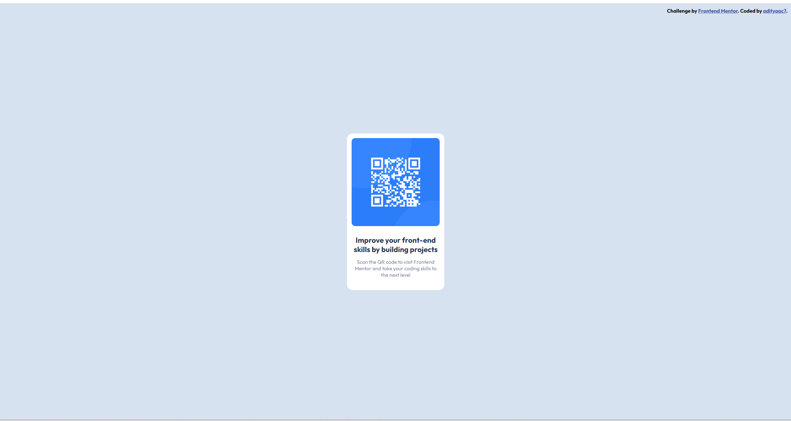

# Frontend Mentor - QR code component solution

This is a solution to the [QR code component challenge on Frontend Mentor](https://www.frontendmentor.io/challenges/qr-code-component-iux_sIO_H). Frontend Mentor challenges help you improve your coding skills by building realistic projects. 

## Table of contents

- [Overview](#overview)
  - [Screenshot](#screenshot)
  - [Links](#links)
- [My process](#my-process)
  - [Built with](#built-with)
  - [What I learned](#what-i-learned)
  - [Continued development](#continued-development)
  - [Useful resources](#useful-resources)
- [Author](#author)

## Overview

Welcome to the QR-Code Component Project! This project demonstrates a simple, static QR code component built using HTML and CSS. The component displays a single QR code that, when scanned, directs the user to the Frontend Mentor hoempage (url: https://www.frontendmentor.io/). The QR code is non-dynamic, meaning it consistently points to the same URL without any interactive or programmable changes.

The project aims to provide a straightforward example of integrating a QR code into a web page, offering an easy way to share a URL through a scannable code. Being my first project, it marks the beginning of my journey into web development, and I hope it serves as a useful and inspiring example for others starting out!

### Screenshot

 captured from Google Chrome for Windows

### Links

- Solution URL: (https://www.frontendmentor.io/solutions/qr-code-component-BEVXnvCfMN)
- Live Site URL: https://adityaac7.github.io/qr-code-component/

## My process

Before starting with the code, I went through all the resources I had and would need in order to complete it perfectly. This included reviewing the design on the .fig file and other images. I drew all the components into boxes in my mind, and replicated it into HTML using `
`s and other elements. Used flexbox to organise all content. Had some difficulties centering the content in the viewport and changing the background-color in the entire viewport, resolved succesfully by trying different things out.

### Built with

- Semantic HTML5 markup
- CSS custom properties
- Flexbox

### What I learned

Learned how to successfully center an element in the middle of a page/viewport, work with figma designs, how to start with GitHub by building the project in a public repository, commiting changes in a project, and a lot more.

### Continued development

I'm still not a 100% sure about my CSS and there are definitely ways to make my code simpler and cleaner. For example, the use of flexbox in my project might not even be needed, yet I have used it. I am waiting on feedback from seniors in my community and will make changes accordingly. There is a high possibility that I will add extra features to this project in the future and make it more dynamic and useful for general use.

### Useful resources

- [Frontendmentor's Discord Community](https://discord.gg/UAfh3qzhYb) - I recieved help from seniors in this community when I was stuck on how to vertically center an element in the viewport. I recommend it to anyone who needs feedback or suggestions regarding their project as well.

- [Article on how to center a div](https://www.joshwcomeau.com/css/center-a-div/) - This is an amazing article which helped me fully understand centering any element (here, a `
`). I'd recommend it to anyone still learning this concept.

## Author

- Frontend Mentor - [@adityaac7](https://www.frontendmentor.io/profile/adityaac7)
- GitHub - [@adityaac7](https://github.com/adityaac7)
